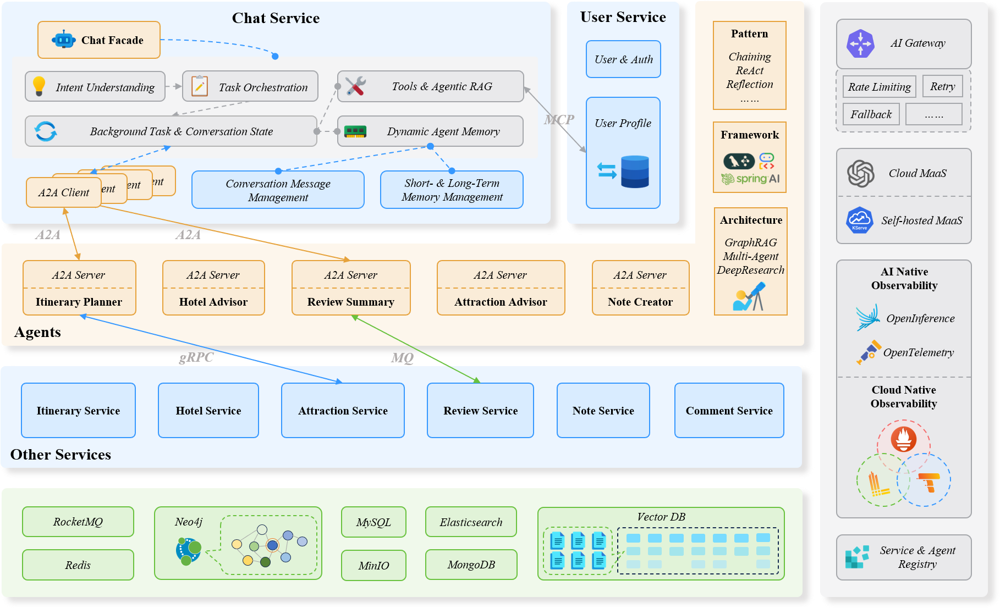

# TripSphere

## Overview

This monorepo contains the TripSphere, an AI-native distributed system based on microservices architecture.



## Quick Start

### Prerequisites

[Task](https://taskfile.dev/#/installation) is required to run the tasks defined in the `Taskfile.yml`. You can run `task` to show all available tasks. [Buf](https://buf.build/) needs to be installed to generate protobuf and gRPC codes.

Set environment variables for OpenAI API key and base URL:

```bash
export OPENAI_API_KEY=your-api-key
export OPENAI_BASE_URL=https://api.openai.com/v1
```

### Protobuf and gRPC Codes

Protobuf and gRPC codes are useful to ensure projects can be compiled in development, and provide hints for IDEs. We use Buf to generate protobuf and gRPC codes. Run `task gen-proto` to generate protobuf and gRPC codes with Buf CLI.

### Development Environment

For development environment, you can use Docker Compose to start the system. Run `task start` to run the services, agents, databases, and middlewares.

## Deployment

Kubernetes deployment is on the way soon. Currently, you can deploy the system using Docker Compose.

## Verification

After starting services, verify the system is running:

<div align="center">

| Service            | URL                             | Description              |
| ------------------ | ------------------------------- | ------------------------ |
| Frontend           | http://localhost:3000           | Next.js Web UI           |
| Nacos Console      | http://localhost:18080          | Service & Agent Registry |
| Grafana            | http://localhost:13000          | Observability            |
| MinIO Console      | http://localhost:9001           | Object Storage           |
| RocketMQ Dashboard | http://localhost:8082           | Message Queue            |
| Neo4j Browser      | http://localhost:7474           | Graph Database           |
| Qdrant Dashboard   | http://localhost:6333/dashboard | Vector Database          |

</div>