# 1. 背景：软件形态正在发生变化

随着大语言模型（LLM）的发展，基于LLM的智能体（Agent）在多个领域的任务中展现出了强大的潜力，成为当前的学术界/工业界流行的技术。人工智能（AI）技术逐渐渗入到业务流程和软件架构中，以Agent为代表的智能化技术与复杂业务系统深度融合的趋势愈发凸显，软件形态正在发生着深刻的演进。

在这种新的形态中，Agent由提示词（Prompt）驱动作为软件系统的核心引擎，具备意图识别和自主规划行动的能力，能够基于对业务逻辑的理解通过工具调用编排业务资源，在动态环境下完成复杂任务。

# 2. 动机：为什么需要TripSphere

近年来，Agentic AI已经开始在真实工作任务中落地，并展现出明显的应用价值。根据Anthropic在2025年发布的Anthropic Economic Index，当前AI的使用最集中的场景是软件开发与技术写作，尤其包括编程、调试、文档撰写等。同时，OpenAI在其2025年的官方介绍中提到，开发者已经利用Agent能力构建客服支持、技术文档检索、旅行预订以及基于浏览器的业务流程自动化等应用。Microsoft则进一步提出将Agent与确定性工作流结合，用于发票处理、税务审计、审批流等企业流程。

当前学术界和工业界对Agentic System的研究大多聚焦于相对封闭、轻状态、任务边界清晰的场景，重点考察Agent是否能够完成某一类任务。相应地，现有研究的关注点也主要集中在Agentic System的共性框架与局部能力上，例如单Agent与多Agent协作机制、记忆管理、工具调用、协议标准化、可观测性与运行支撑等。总体来看，这些工作更多还是从组件和机制的视角展开，探索的重心仍停留在“局部能力”层面。

然而人们对Agentic AI的期待不止于“完成单点任务”，而是进一步“成为企业运行闭环中的一部分”——能够结合业务知识、组织规则与系统数据，围绕具体业务目标参与决策、协同与执行。在这样的场景下，Agent面对的不再是一个相对封闭、轻状态的任务环境，而是由业务流程、权限边界、服务接口、数据库、缓存及云基础设施共同构成的复杂运行世界。

因此，我们发布了一个AI原生Benchmark系统TripSphere，并在[GitHub - FudanSELab/TripSphere: A Benchmark AI-Native System](https://github.com/FudanSELab/TripSphere)开源。TripSphere不是一个只用于封闭任务求解的测试环境，而是一个面向AI与复杂业务系统深度融合场景的开放实验床。它具备全栈、云原生、有状态、可部署等特点，并包含了真实业务拓扑、AI原生组件与多种异构后端技术。

- 业务规则、系统约束与运行状态如何共同影响Agent的规划与执行？
- 跨服务与长周期任务中的状态如何协同演化？
- Agent深度融入后系统的可观测性、调试与评测将如何变化？
- ……
面对这些重要的问题，我们希望该开源项目能为学术界和工业界提供一个研究智能化软件系统的开放基础，支撑研究者在真实业务拓扑和动态系统环境中开展研究，推动对Agentic AI与复杂业务系统深度融合后的体系结构、评测、调试与治理等问题的持续探索。

# 3. TripSphere：AI原生Benchmark系统

## 3.1. 系统概览

TripSphere是一个全栈的、分布式的、持续演进的AI原生应用，旨在为智能化软件系统的研究者提供一个开放的“试验场”。它以在线旅游平台为背景，除了景点、酒店查询等典型业务，还支持AI智能行程规划、AI辅助下单、AI点评摘要等智能化功能，尝试将Agentic AI融入用户交互、业务编排、资源处理等环节。

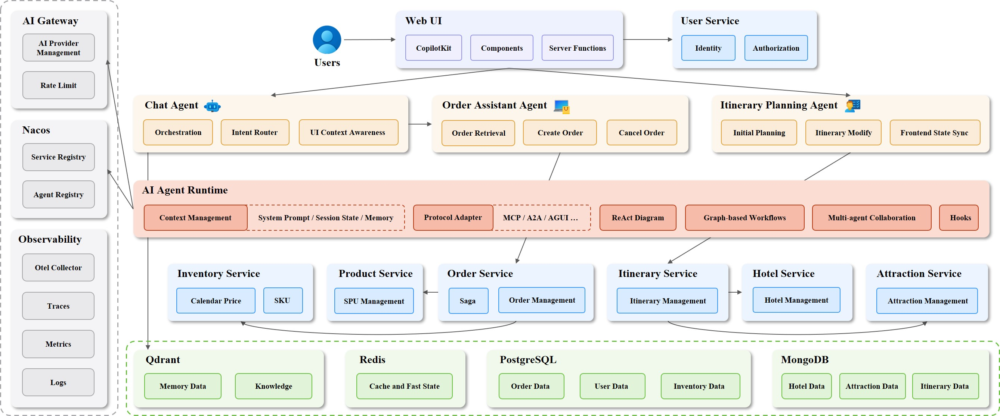

TripSphere v0.1.0版本当前包含可部署的7个业务微服务与3个Agent服务。除了服务注册中心、分布式缓存、关系型数据库等传统微服务组件之外，系统还引入了向量数据库、AI Gateway、记忆组件等AI原生相关组件。Agent在该系统中能感知WebUI上下文，能通过工具主动操纵业务资源，这使得TripSphere不只是一个业务系统原型，更是一个能够支持业务服务与智能体协作的实验环境。

从构建AI原生系统的角度来看，TripSphere当前并不是简单地在传统微服务系统之上“接入一个大模型”，而是在若干关键位置逐步引入新的AI原生要素。例如，模型接入通过统一AI Gateway进行路由；Agent以独立服务形式存在，并通过Nacos与A2A协议进行注册、发现与协作；向量数据库、记忆、MCP工具与远程Agent调用等能力也开始进入系统运行上下文；同时，围绕模型调用和Agent执行链路的可观测性也被纳入统一观测栈之中；此外，我们还通过AGUI协议将Agent接入到用户交互界面，让Agent能感知WebUI上下文，并能通过工具主动操纵相关业务资源。这些设计为智能化软件系统研究以及进一步探索Agentic AI与复杂业务系统深度融合提供了一定的结构基础。

总的来说，TripSphere具有以下方面的特点：
- 异构的全栈实现：系统同时包含前端界面、Agent服务和后端业务服务。前端基于Next.js与CopilotKit，Agent相关逻辑主要由Python实现，领域服务主要基于SpringBoot+gRPC构建，在涉及的技术栈上具有多样性。
- 云原生系统基础：系统整体以微服务方式组织，并采用容器化部署，v0.1.0版本支持通过Docker Compose启动。系统使用Nacos进行服务发现，基于gRPC与HTTP进行服务间通信，并结合PostgreSQL、MongoDB、Redis以及OpenTelemetry、Tempo、Grafana等组件，形成了一个可部署、可观测的分布式系统。
- 面向Agentic AI的扩展：在传统业务服务之外，系统采用了统一的模型调用网关、独立的Agent服务、A2A协作、MCP工具调用、记忆管理和向量检索，并补充了模型调用与Agent执行链路的观测支持。这使得研究对象不再局限于已有的微服务架构，还包括模型调用、工具使用、多Agent协作与上下文管理等新的AI原生要素。

## 3.2. 端到端示例

为了更具体地说明TripSphere中Agentic AI如何与业务系统协同工作，下面我们以一次AI辅助下单的端到端流程为例，展示用户请求如何从前端交互进入系统，并在两个Agent与多个后端业务服务的协同下完成一次真实业务操作。在这个示例中，我们不仅展示用户侧的操作过程和最终结果，也结合同一流程对应的分布式调用链来观察系统内部发生了什么。

首先，用户在登录后进入首页，可以看到左侧导航栏包含“酒店”、“景点”和“我的行程”等入口。前端的右侧则常驻一个AI旅行助手，用户可以在这里输入问题，AI助手会根据上下文理解用户意图，并给出回答。例如，用户可以向其询问热门城市的天气情况，AI旅行助手会实时查询天气情况并告知用户结果。

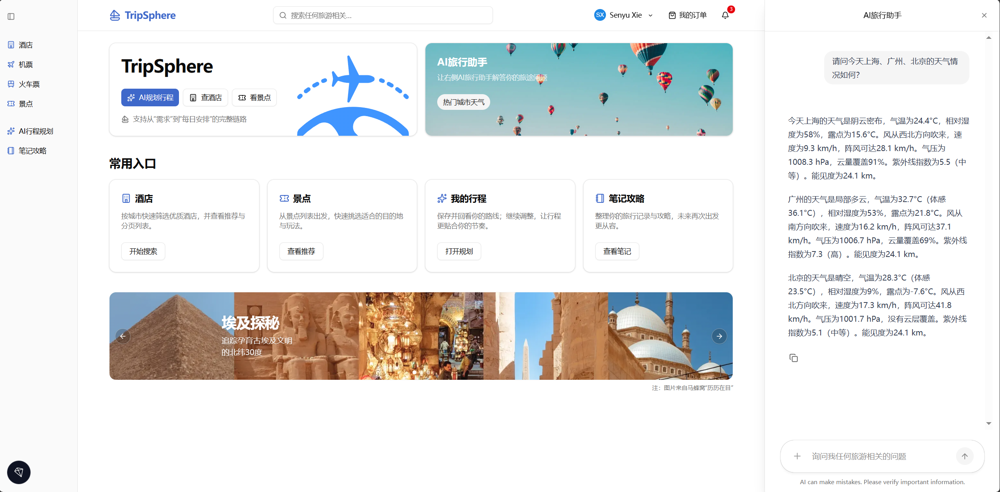

我们使用tempo作为分布式调用链的可观测性后端，并在Grafana中展示采集到的调用链数据。如上图所示，当用户同时询问北京、上海和广州的当天天气时，Agent理解意图后通过工具调用查询三个城市的天气情况（对应图中三个并行的`get_current_weather`MCP工具调用），并返回汇总后的查询结果。

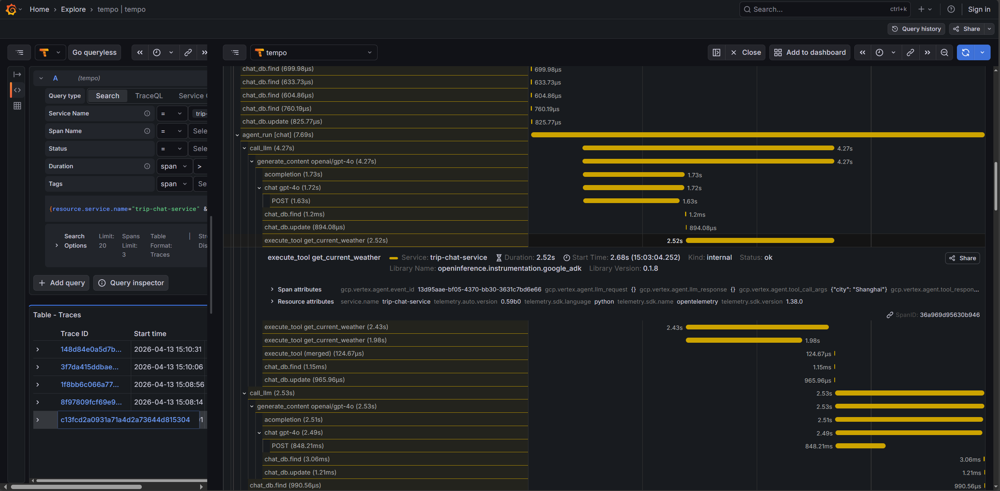

接下来，用户可以通过左侧的导航栏进入“酒店”功能模块，并点击进入一家酒店的具体详情页面。该页面会展示酒店的概览信息、房型列表、服务及设施、政策、地址等详细信息。

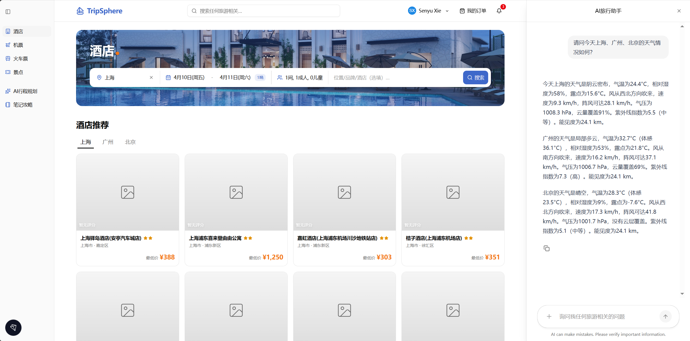

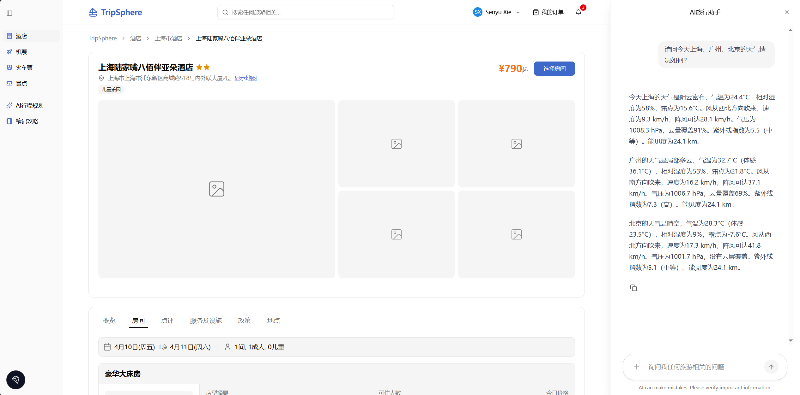

利用CopilotKit组件和AGUI协议，基于Next.js框架的前端可以将用户当前正在浏览的页面信息同步到Agent的上下文中，从而让Agent能够感知用户当前的浏览状态。例如，当用户在酒店详情页面时，Agent可以感知到用户正在浏览的酒店信息，当用户询问关于某个特定房型、价格范围或服务设施时，Agent就可以利用这部分上下文信息进行回答。

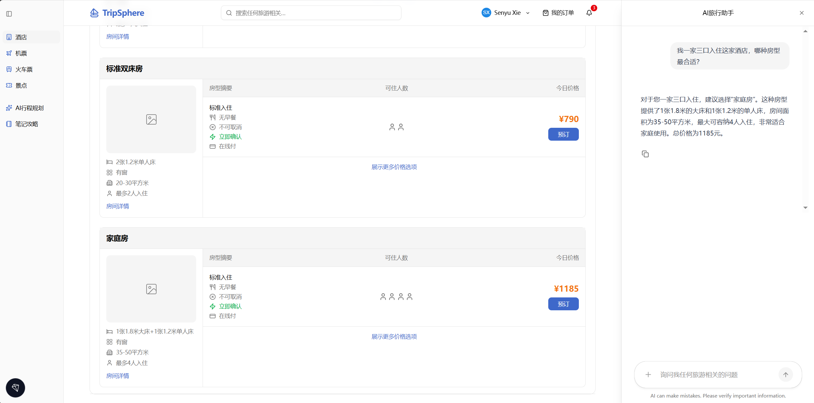

如上图所示，用户咨询了一家三口入住房型的选择，Agent感知到用户当前正在浏览的酒店有“家庭房”房型，因此推荐了家庭房。从下图的分布式调用链中我们可以看到，Agent通过工具调用`hotel_viewing_get_room_types`从state中获取了酒店的房型列表，并根据用户给出的信息推荐了家庭房。

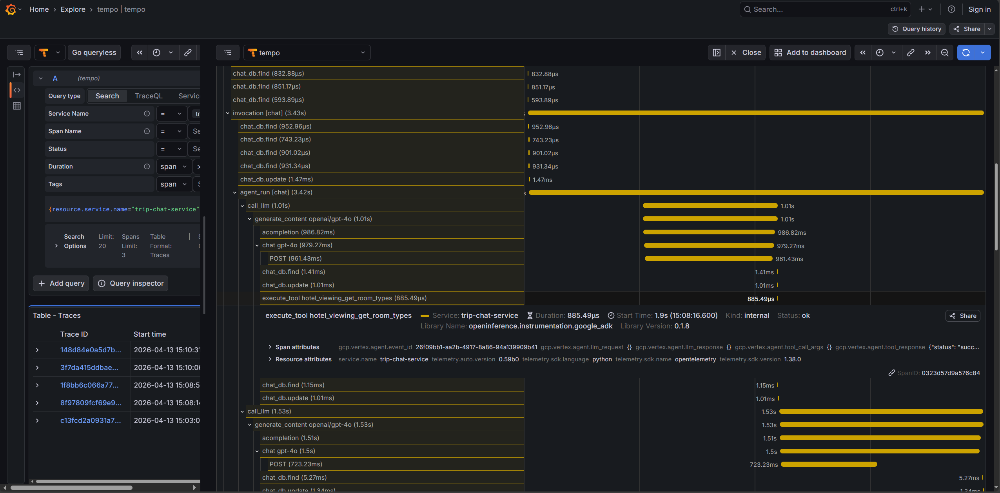

接着，用户将订房请求告知了Agent，但只使用了“这个房型”的模糊代指。Agent则基于当前的上下文理解了用户希望入住的是“家庭房”，基于房型、房间数量和入住退房日期等信息Agent完成了订单的创建，并返回了订单创建的结果。同时，我们在个人订单的页面也可以看到当前用户的这笔订单处于待支付状态。

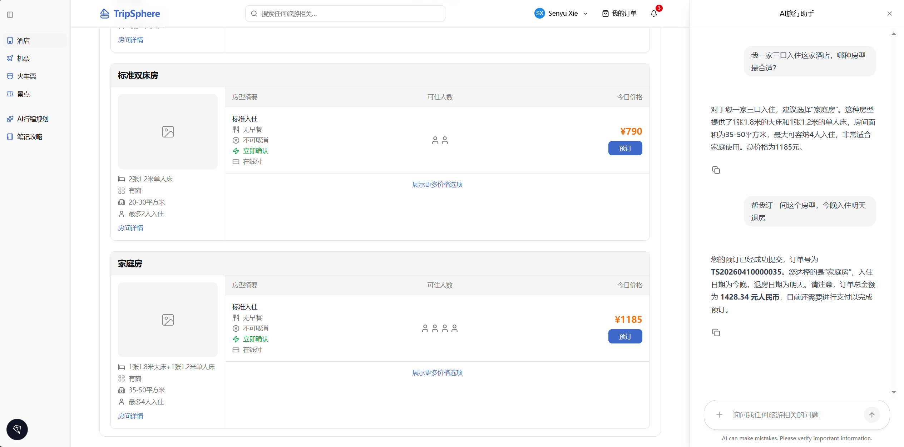

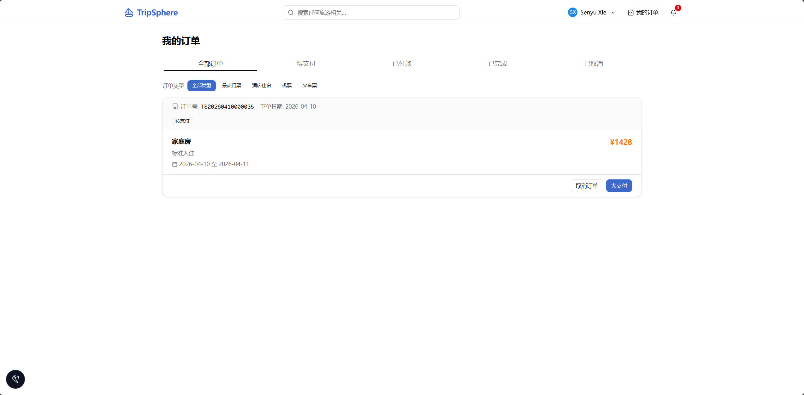

通过对分布式调用链的分析，我们可以观察到系统的这个业务流程涉及到2个Agent个多个微服务。首先`chat_agent`基于当前的上下文识别到用户希望下单订房，因此通过工具调用`transfer_to_agent`把Runtime控制转交给`order_assistant`（一个专门用于处理订单的`RemoteA2aAgent`），`RemoteA2aAgent`的底层通过A2A Client与实际实现了A2A协议的远程Agent实现通信。

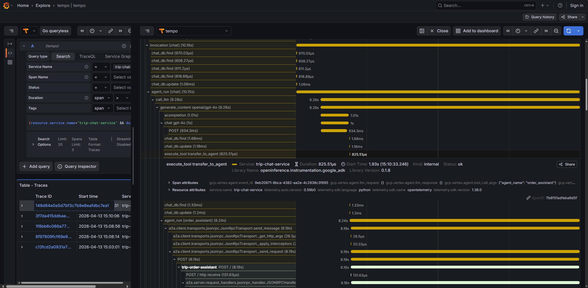

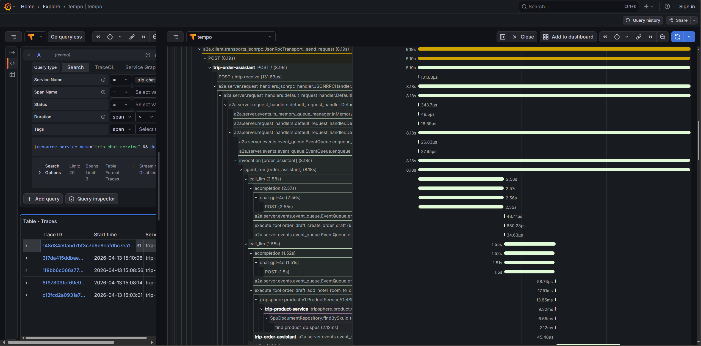

基于A2A协议，`order_assistant`能感知到`chat_agent`的上下文，并基于该上下文继续执行订单创建的流程。可以看到，为了创建订单它会调用相关的工具去检查房型对应的商品信息，然后把商品打包到一个Order Draft中一次性提交发起订单创建。

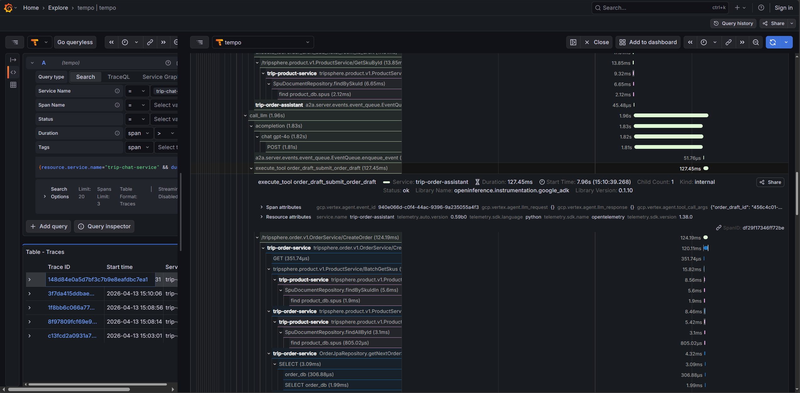

具体来说，`order_assistant`通过工具调用`trip-order-service`这个业务服务的gRPC接口，然后触发创建订单的Saga。这个Saga会依次调用`trip-product-service`和`trip-inventory-service`去检查房型对应的商品信息和库存情况，如果检查通过则继续锁定库存、计算订单价格等等的步骤，最终完成订单的创建。

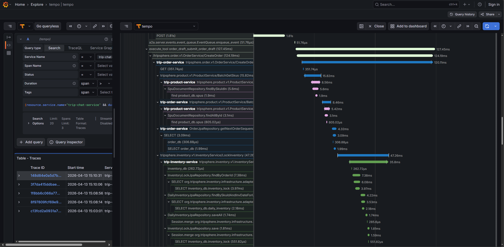

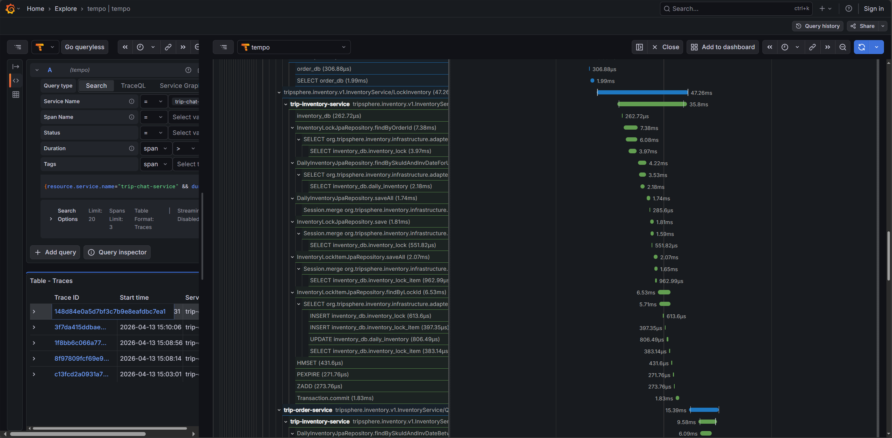

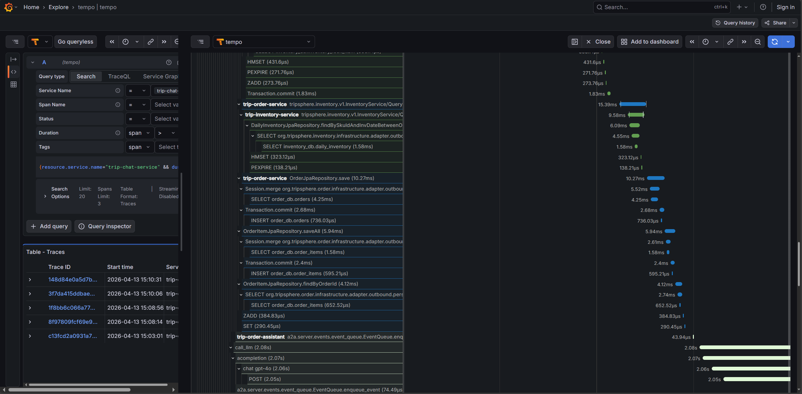

当订单创建完成后，如果用户希望取消订单，也可以直接在右侧的AI旅行助手中通过对话的方式进行取消。Agent会首先对这次请求进行确认，当用户明确取消意图后，Agent再实际触发取消订单相关的业务逻辑。当Agent告知订单取消完成后，我们在个人订单的页面也可以看到当前用户的这笔订单已处于取消状态。

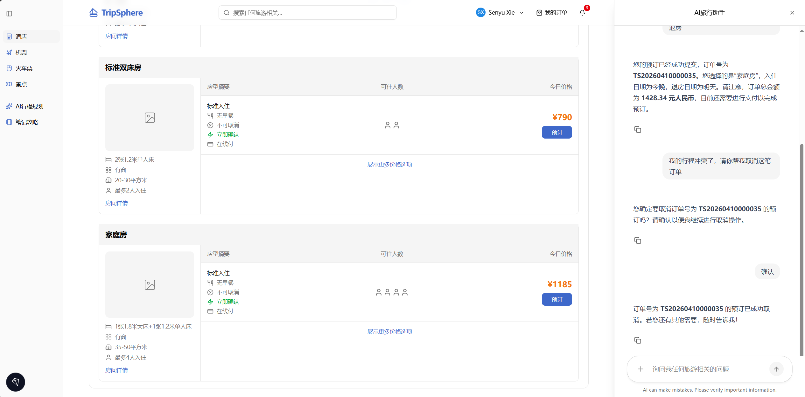

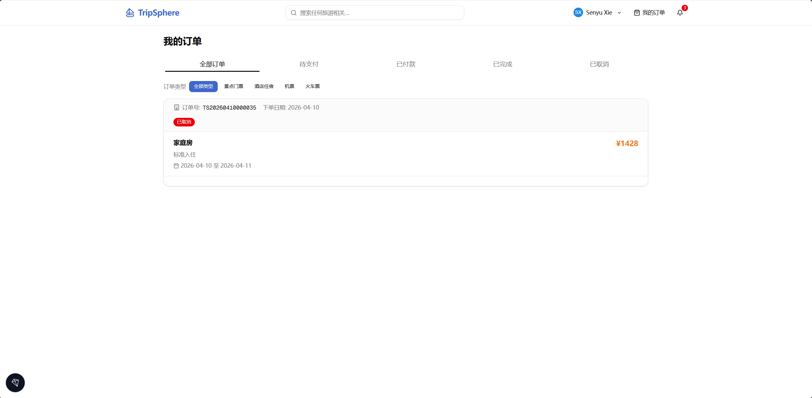

这个示例涉及意图理解、状态读取、服务调用和业务对象更新，是将Agentic AI融入复杂业务系统的一次简单尝试，希望通过这个例子能帮各位读者更好地理解TripSphere的设计与运行。

# 4. TripSphere支撑的研究内容

TripSphere的目标是为AI原生应用的体系结构、评测、开发和运维研究提供一个开放的“试验场”。与多数聚焦封闭任务求解的benchmark相比，它更强调真实业务流程、跨服务协同和持续变化的系统状态。在这样的系统级的视角下，研究背景不再只是Agent能否完成某个任务，而是Agentic AI融入真实业务系统后，会如何影响整个系统的设计、开发、验证和运行。

从体系结构的角度看，TripSphere把前端交互、Agent运行时、业务微服务、数据库和缓存等要素组织在同一个系统里，提供了一个较完整的AI原生系统原型。例如行程规划和AI辅助下单这类跨服务流程，Agent既要理解用户意图，又要协调多个业务能力并处理动态状态变化。借助这样的系统形态，研究者可以进一步探索Agent应如何与服务、数据和业务流程协同组织，以及不同架构选择会怎样影响整体效果、资源开销和能力边界。

当任务从单轮问答扩展到行程规划或订单处理这类长生命周期业务流程时，错误往往不会在首轮问答时立即暴露，而会随着上下文变化和业务状态演化在后续步骤中逐步累积，评测对象就不再只是某一步答得对不对。基于TripSphere，研究者可以更自然地从系统视角进行评测：既看Agent的规划是否稳定、工具使用是否合适、最终结果是否正确，也看它在业务状态变化和连续交互中能否及时调整和维持结果质量，最终交付给用户的内容是否清楚可信。

对于智能化软件系统的开发而言，TripSphere的意义不只在于保留了长链路、多状态和多组件协同带来的真实难点，更在于它为探索Agentic AI与复杂业务系统深度融合的开发方式提供了一个较接近真实场景的试验场。由于这里既有行程规划、辅助下单等业务流程，也有Agent服务、工具调用和状态化后端，研究者和开发者可以据此讨论面向企业级智能系统的开发过程应如何更好地把需求理解、业务规则建模、能力配置和服务集成连接起来，并进一步探索其中哪些环节可以获得更高程度的自动化支持。

AI原生系统需要面对模型幻觉、上下文偏差和工具误用等新的不确定性，其运行阶段往往比传统系统更难观察和治理。TripSphere同时包含业务代码、智能体和多类基础组件的复杂架构，可以支撑这类系统环境下的可观测、监控和治理研究。以TripSphere为试验场景，研究者可以探索如何把Agent执行轨迹、业务服务调用链与系统遥测信号结合分析，例如分析一次行程规划或AI辅助下单过程中，智能体决策、服务状态与业务结果之间是如何相互影响的，从而进一步讨论AI原生系统应如何被持续监测、及时干预并保持稳健运行。

# 5. 尾声与展望

TripSphere目前已在GitHub开源：[GitHub - FudanSELab/TripSphere: A Benchmark AI-Native System](https://github.com/FudanSELab/TripSphere)

欢迎大家Star、提Issue、提交Pull Request，也欢迎围绕新的业务场景、Agent能力、评测任务与系统工具链共同扩展这个项目。我们希望TripSphere能够成为连接学术研究与工程实践的一块公共基础，让更多关于AI原生系统的讨论建立在可部署、可运行、可观测、可复现的真实环境之上。

在此基础上，我们也将围绕AI原生系统的体系结构、评测方法、故障调试、执行链路分析与智能化运维等方向持续开展研究工作。

未来我们将持续维护并完善该系统，逐步引入更丰富的业务场景、更复杂的任务流程，以及更完善的多Agent协作、记忆管理、治理控制和混沌工程等实践特性。

欢迎各位学术界和工业界的研究者与实践者试用该系统，并提出宝贵意见。

> 文中演示内容涉及的数据来自[ChinaTravel Benchmark](https://www.lamda.nju.edu.cn/shaojj/chinatravel/)以及[高德开放平台](https://lbs.amap.com/)提供的地图/位置能力，仅用于科研与技术验证。后续如发布进一步的演示案例或样例数据，我们也将相应地进行整理和说明。

# 参考文献

1. Anthropic. The Anthropic Economic Index[EB/OL]. (2025-02-10)[2026-04-04]. https://www.anthropic.com/research/the-anthropic-economic-index.
2. OpenAI. New tools for building agents[EB/OL]. (2025-03-11)[2026-04-04]. https://openai.com/index/new-tools-for-building-agents/.
3. Microsoft. Introducing agent flows: Transforming automation with AI-first workflows[EB/OL]. [2026-04-04]. https://www.microsoft.com/en-us/microsoft-copilot/blog/copilot-studio/introducing-agent-flows-transforming-automation-with-ai-first-workflows/.
4. Masterman T, Besen S, Sawtell M, et al. The landscape of emerging ai agent architectures for reasoning, planning, and tool calling: A survey[J]. arXiv preprint arXiv:2404.11584, 2024.
5. Zhang Z, Dai Q, Bo X, et al. A survey on the memory mechanism of large language model-based agents[J]. ACM Transactions on Information Systems, 2025, 43(6): 1-47.
6. Ehtesham A, Singh A, Gupta G K, et al. A survey of agent interoperability protocols: Model context protocol (mcp), agent communication protocol (acp), agent-to-agent protocol (a2a), and agent network protocol (anp)[J]. arXiv preprint arXiv:2505.02279, 2025.
7. Shao J J, Zhang B W, Yang X W, et al. Chinatravel: An open-ended benchmark for language agents in chinese travel planning[J]. arXiv preprint arXiv:2412.13682, 2024.
